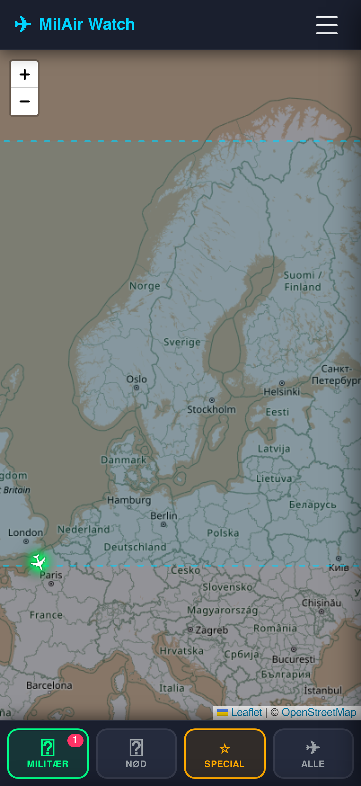
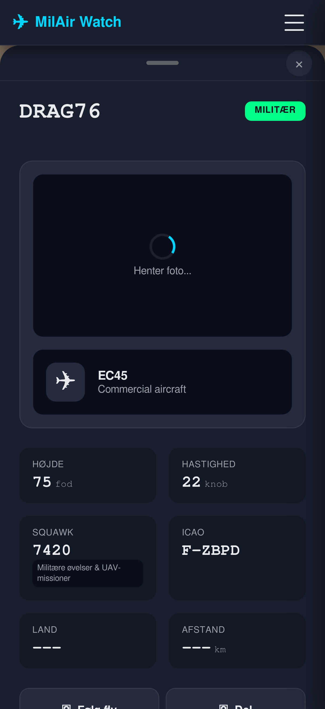
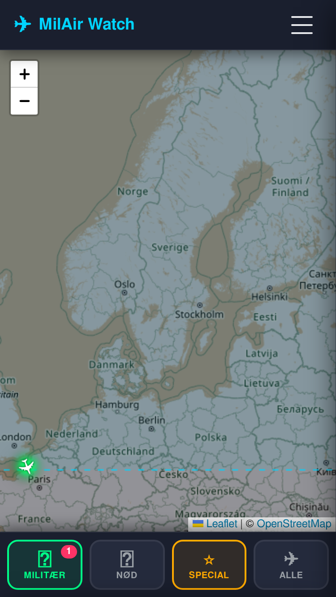
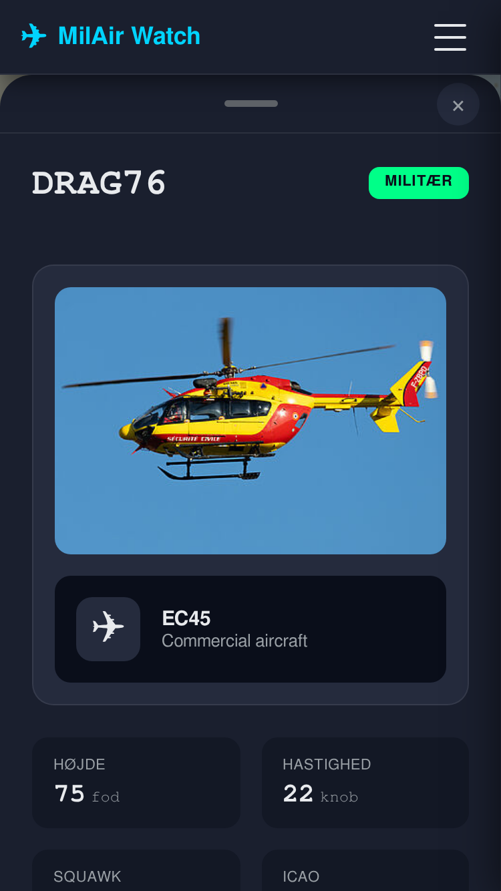
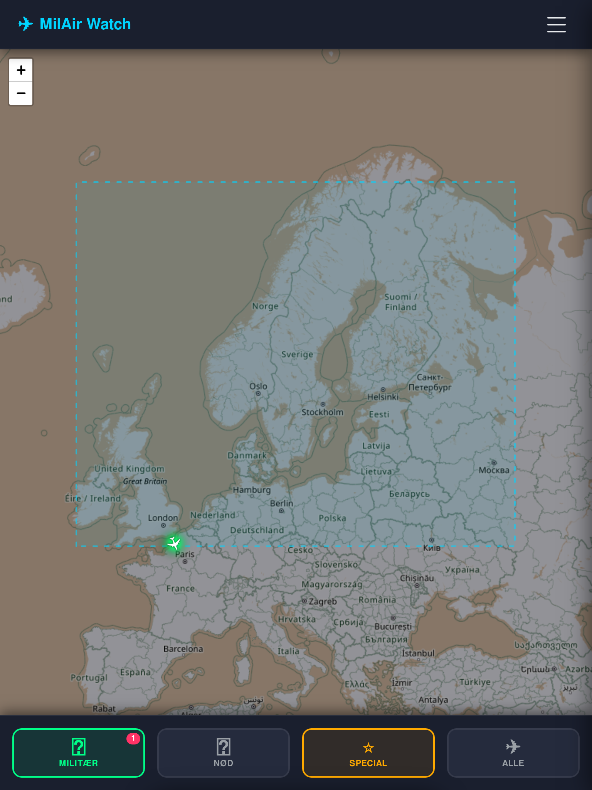
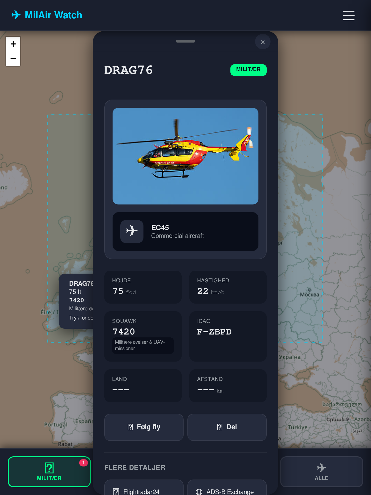
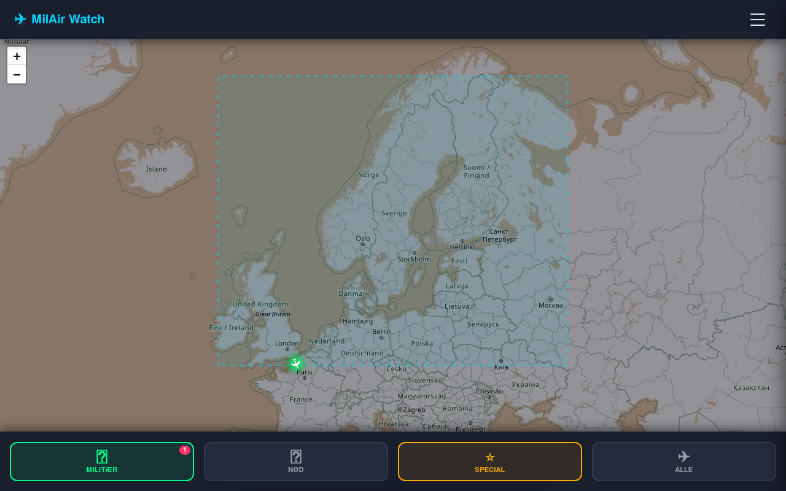
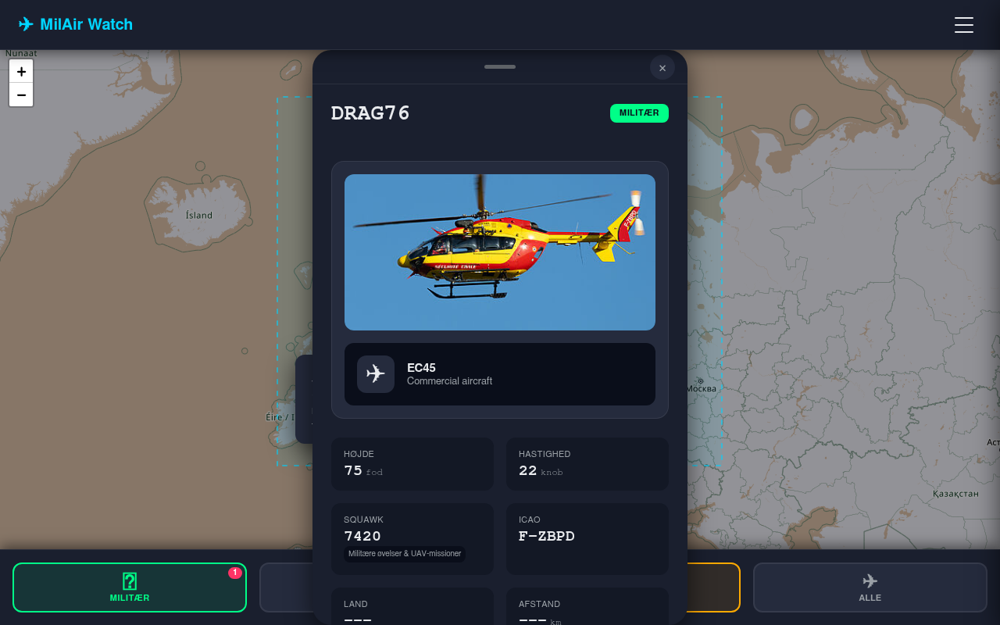

# MilAir Watch - Live Militær Fly Radar

> Real-time tracking af militære fly og nødsituationer via åbne ADS-B data.

**Live site:** https://joachimth.github.io/adsb-planes-mil/

---

## Hvad det er

MilAir Watch viser live-positioner for militære fly og fly med nød-squawk-koder på et interaktivt radar-kort. Data hentes fra [ADSB.lol API'en](https://www.adsb.lol/api/) og opdateres hvert 30. sekund.

## Funktioner

- **Live radar-kort** - Fly med farvekodede markører: grøn (militær), rød (nød), gul (special), blå (civil)
- **Kategorifiltere** - Militær / Nød / Special / Alle fly
- **Geografiske regioner** - Danmark, Nordeuropa, Europa, Nordatlanten, Global
- **Listevisning** - Sorterbar liste over fly med detaljer
- **Nød-detektering** - Automatisk alarm og zoom ved squawk 7500/7600/7700
- **Heatmap** - Visualiser flyaktivitet (densitet, højde, type)
- **Flydetaljer** - Bottom sheet med ICAO, squawk, højde, hastighed, og links til Flightradar24 / ADS-B Exchange
- **PWA** - Kan installeres på iOS/Android hjemskærm

## Screenshots

Automatisk genereret via `scripts/render-screenshots.js` med Puppeteer headless browser. Screenshots viser appen med live flydata fra ADSB.lol API'et.

### iPhone 17 Pro (402×874, 3x retina)

<table>
  <tr>
    <td align="center"><b>Kortvisning</b></td>
    <td align="center"><b>Bottom sheet — flydetaljer</b></td>
  </tr>
  <tr>
    <td></td>
    <td></td>
  </tr>
</table>

### iPhone SE (375×667)

<table>
  <tr>
    <td align="center"><b>Kortvisning</b></td>
    <td align="center"><b>Bottom sheet — flydetaljer</b></td>
  </tr>
  <tr>
    <td></td>
    <td></td>
  </tr>
</table>

### iPad (768×1024)

<table>
  <tr>
    <td align="center"><b>Kortvisning</b></td>
    <td align="center"><b>Bottom sheet — flydetaljer</b></td>
  </tr>
  <tr>
    <td></td>
    <td></td>
  </tr>
</table>

### Desktop (1280×800)

<table>
  <tr>
    <td align="center"><b>Kortvisning</b></td>
    <td align="center"><b>Bottom sheet — flydetaljer</b></td>
  </tr>
  <tr>
    <td></td>
    <td></td>
  </tr>
</table>

> Screenshots viser live militærfly med farvekodede markører, filter-bar, og bottom sheet med flydetaljer (kaldesignal, højde, hastighed, squawk, ICAO, foto, og links til Flightradar24 / ADS-B Exchange).

---

## Teknisk stack

- Vanilla JavaScript ES6+ (ingen frameworks)
- Leaflet.js 1.9.4 (kort)
- ADSB.lol v2 API (militær endpoint + region-endpoint)
- ADSB.fi API (backup flytype-opslag)
- corsproxy.io (CORS proxy)
- GitHub Pages (hosting, `docs/` mappe)

## Filstruktur

```
adsb-planes-mil/
├── index-mobile.html          # Kilde-HTML (deployed → docs/index.html)
├── style-mobile.css           # Kilde-CSS  (deployed → docs/style.css)
├── js/                        # JavaScript moduler
│   ├── main-mobile.js         # Hoved-controller
│   ├── mobile-ui.js           # UI-komponenter (bottom sheet, menu)
│   ├── filter-bar.js          # Filtreringslogik
│   ├── list-view.js           # Listevisning
│   ├── map_section_mobile.js  # Leaflet-kort med farvekodede markører
│   ├── regions.js             # Geografiske regioner med bounding boxes
│   ├── heatmap.js             # Heatmap-visualisering
│   ├── aircraft-info.js       # Flytype-opslag (ADSB.lol + ADSB.fi)
│   └── squawk-lookup.js       # Squawk-kode database
├── squawk_codes.json          # Squawk-kode database
├── docs/                      # GitHub Pages deployment (auto-synkroniseret)
│   └── screenshots/           # Automatisk genererede device screenshots
├── scripts/
│   └── render-screenshots.js  # Puppeteer screenshot rendering script
├── deploy-to-docs.sh          # Manuel deployment-script
└── .github/workflows/         # CI/CD (auto-deploy ved push til main)
```

## Lokal udvikling

```bash
# Klon repo
git clone https://github.com/joachimth/adsb-planes-mil.git
cd adsb-planes-mil

# Start lokal server (JavaScript ES6 moduler kræver HTTP server)
python -m http.server 8000
# Åbn http://localhost:8000/index-mobile.html
```

## Deployment

GitHub Actions deployer automatisk `docs/` til GitHub Pages ved hvert push til `main`.

Hvis du har ændret kildefilerne og vil synkronisere `docs/` manuelt:

```bash
./deploy-to-docs.sh
git add docs/ && git commit -m "chore: sync docs/"
git push
```

> **Note:** GitHub Pages skal være konfigureret til at bruge `docs/`-mappen under Settings → Pages.

## Licens

MIT - Copyright 2025 Joachim Thirsbro
